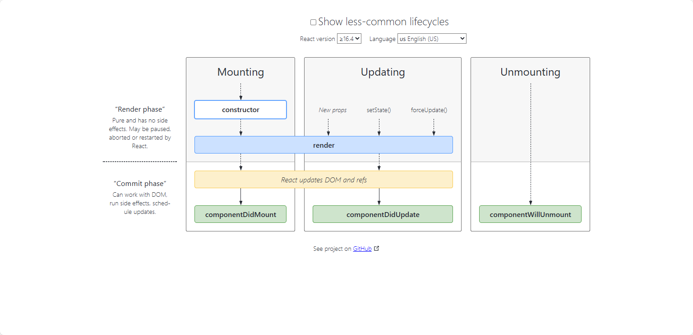
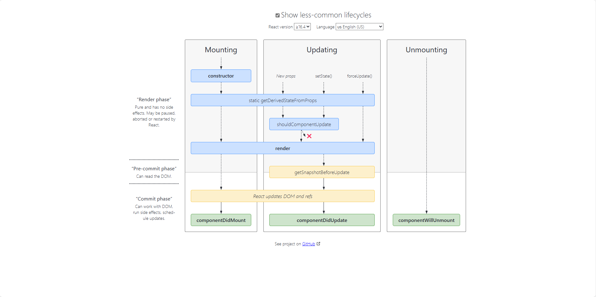

# React18-Hooks

React18 全家桶+Hooks+项目实战

# 1.到底什么是 React？

.官方解释：用于构建用户界面的 JavaScript 库
1.1 React 的技术特点  
.React 由 Facebook 来更新和维护，它是大量优秀程序员的思想结晶  
.大量流行的其他框架借鉴 React 的思想  
--Vue Composition API 学习了 React Hooks 的思想

# 2.三大框架流行趋势

.Vue, React, Angular

# 3.如何学习 React？

1.官方文档  
.如何抓住重点  
.如何进行实战练习  
.更多作为查阅的手册

2.看书学习  
.书的质量必须很高  
.必须收到进行练习  
.遇到问题如何解决

3.开源项目  
.非常好的学习手段  
.需要具备一定的学习能力，需要一定基础

4.视频课程  
.比较适合大多数人  
.讲课人本身的能力  
.视频质量要高，听得懂，学得会

# 4.课程核心内容介绍

# 4.1.邂逅 React18.x 开发

.React 的介绍和特点
.React 是什么？  
.React:用于构建用户界面的 JavaScript 库  
.React 的官网文档：https://zh-hans.reactjs.org/  
.声明式：当数据变动时 React 能高效更新并渲染合适的组件  
.组件化：组件逻辑使用 JavaScript 编写而非模版，因此你可以轻松地在应用中传递数据，并保持状态与 DOM 分离  
.一次学习，跨平台编写：React 还可以使用 Node 进行服务器渲染，或使用 React Native 开发原生移动应用

.Hello React 案例

.在界面显示一个文本：Hello World  
.点击下方的一个按钮，点击后文本改变为 Hello React

.React 开发 1 依赖分析
1.react：包含 react 所必须的核心代码  
2.react-dom：react 渲染在不同平台所需要的核心代码  
3.babel：将 jsx 转换成 React 代码的工具

一.第一次接触 React 会被它频繁的依赖搞蒙，居然依赖这么多东西  
.对 Vue 来说，我们只是依赖一个 Vue.js 文件即可，但是 react 居然要依赖三个包  
.其实呢，这三个库是各司其职的，目的就是让每个库只单纯做自己的事情  
.在 React 的 0.14 版本之前是没有 react-dom 这个概念的，所有功能都包含在 react 里

二.为什么要进行拆分呢？原因就是 react-native  
.react 包中包含了 react web 和 react-native 所有共同拥有的核心代码  
.react-dom 针对 web 和 native 所完成的事情不同：  
-1.web 端：react-dom 会将 jsx 最终渲染成真实的 DOM，显示在浏览器中  
-2.native 端：react-dom 会将 jsx 最终渲染成原生的控件（比如 Android 中的 Button，IOS 中的 UIButton）

三.babel 是什么？  
.Babel，又名 Babel.js  
.是目前前端使用非常广泛的编译器，转移器.  
.比如当下很多浏览器并不支持 ES6 的语法，但是确实 ES6 的语法非常的简洁和方便，我们开发时希望使用它.  
.那么编写源码时我们就可以使用 ES6 来编写，之后通过 Babel 工具，将 ES6 转成大多数浏览器都支持的 ES5 的语法

四.React 和 Babel 的关系  
.默认情况下开发 React 可以不使用 babel。  
.但是前提是我们自己使用 React.createElement 来编写源代码，它编写的代码非常的繁琐和可读性差。  
.那么我们就可以直接编写 jsx（JavaScript XML）的语法，并且让 babel 帮助我们转换成 React.createElement.  
.使用 babel 转化代码，会默认启用"use strict"，变成严格环境

# React 组件化的封装

1.整个逻辑其实可以看做一个整体，那么我们就可以将其封装成一个组件：  
.我们说过 root.render 参数是一个 HTML 元素或者一个组件；  
.所以我们可以先将之前的业务逻辑封装到一个组件中，然后传入到 ReactDOM.render 函数中的第一个参数

2.在 React 中，如何封装一个组件呢？这里我们暂时使用类的方式封装组件  
.定义一个类（类名大写，组件的名称是必须大写的，小写会被认为是 HTML 元素）。继承自 React.Component  
.实现当前组件的 render 函数  
.-rander 当中返回的 jsx 内容，就是之后 React 会帮助我们渲染的内容

# 组件化-数据依赖

.组件化问题一：数据在哪里定义？  
.组件中的数据，我们可以分成两类  
.1.参与界面更新的数据：当数据变量时，需要更新组件渲染的内容；  
.2.不参与界面更新的数据：当数据变量时，不需要更新将组建渲染的内容

.参与界面更新的数据我们可以称为是：参与数据流，这个数据是定义在当前对象的 state 中  
.我们可以通过在构造函数中 this.state = {定义的数据}  
.当我们的数据发生变化时，我们可以调用 this.setState 来更新数据，并且通知 React 进行 updata 操作  
.在进行 update 操作时，就会重新调用 render 函数。并且使用最新的数据，来渲染界面  
.在类里面，默认就是严格模式  
.类组件里面 render 函数当中的 this，指向的是当前实例  
.类组件里面的方法当中的 this 指向 undefined

# 组件化-事件绑定

1.组件化问题二：事件绑定中的 this  
.在类中直接定义一个函数，并且将这个函数绑定到元素的 onClick 事件上，这个函数的 this 指向的是谁？ 2.默认情况下是 undefined 2.默认情况下是 underfined  
.很奇怪，居然是 undefined  
.因为在正常的 DOM 操作中，监听点击，监听函数中的 this 其实是节点对象（比如说是 button 对象）；  
.这是因为 React 并不是直接渲染成真实的 DOM，我们所编写的 button 只是一个语法糖，它本质是 React 的 Element 对象；  
.那么在这里发生监听的时候，react 在执行函数时并没有绑定 this，默认情况下就是 undefined 3.我们在绑定的函数中，可能想要使用当前对象，比如执 行 this.setState 函数，就必须拿到当前对象的 this  
.我们就需要在传入函数时，给这个函数直接绑定 this  
.类似于下面的写法：<button onClick={this.changeText.bind(this)}>改变文本</button>

# 生成代码片段

.1.复制自己需要生成代码片段的代码；  
.2.https://snippet-generator.app/在该网站中生成代码片段  
.3.在 VSCode 中配置代码片段

.React 数据事件处理  
.React 其他案例实现

# React 基础 - JSX 语法

1.JSX 是什么？  
.JSX 是一种 JavaScript 的语法扩展(eXtension),也在很多地方称之为 JavaScript XML，因为看起来就是一段 XML 语法；  
.它用于描述我们 UI 界面，并且其完全可以和 JavaScript 融合在一起使用  
例子：const element = <h1>Hello, world!</h1>;  
html 写进了 js（html in js），css 也可以写进去（css in js），所以也可以成为 all in js

问题：为什么 React 选择 JSX？  
React 认为渲染逻辑本质上与其他 UI 逻辑存在内在耦合（html 和 js），比如，在 UI 中需要绑定事件（button，a 原生）、状态等。  
他们之间是密不可分，所以 React 没有标记分离到不同的文件中，而是将它门组合到一起，这个地方就是组件（Component）  
.这里我们只需要知道，JSX 其实是嵌入到 JavaScript 中的一种结构语法

.JSX 的书写规范  
--JSX 的顶层只能有一个根元素，所以我们很多时候会在外层包裹一个 div 元素  
--为了方便阅读，我们通常在 jsx 的外层包裹一个小括号(),这样可以方便阅读，并且 jsx 可以进行换行书写  
--JSX 中的标签可以是单标签，也可以是双标签，单标签，必须以/>结尾

2.JSX 的基本使用  
.JSX 的注释：{/_ 注释内容 _/}

2.1.JSX 嵌入变量作为子元素  
.情况一：当变量是 Nunber，String，Array 类型时，可以直接显示  
.情况二：当变量是 null，undefined，Boolean 类型时，内容为空  
--如果希望可以显示 null，undefined，false，需要转成字符串  
--转换的方式有很多，比如 toString 方法，和空字符串拼接，String(变量)等  
.情况三：Object 对象类型不能作为子元素

2.2.JSX 嵌入表达式  
.运算表达式  
.三元运算符  
.执行一个函数

2.3.JSX 的使用  
.jsx 绑定属性  
..比如元素都会有 title 属性  
..比如 img 元素会有 src 属性  
..比如 a 元素会有 href 属性  
..比如元素可能需要绑定 class  
..比如原生使用内联样式 style

3.JSX 的事件绑定  
.如果原生 DOM 原生有一个监听事件，我们可以如何操作呢?  
..方式一：获取 DOM 原生，添加监听事件  
..方式二：在 HTML 原生中，直接绑定 onclick

.在 React 中是如何操作呢？我们来实现一下 React 中的事件监听，这里主要有两点不同  
..React 事假的命名采用小驼峰（camelCase），而不是纯小写；  
..我们需要通过{}传入一个事件处理函数，这个函数会在事件发生时被执行

this 的绑定问题  
.在事件执行后，我们可能需要获取当前类的对象中相关的属性，这个时候需要用到 this  
..如果我们直接打印 this，会发现是 undefined

.为什么是 undefined 呢？  
..原因是 btnClick 函数并不是我们主动调用的，而且当 button 发生改变时，React 内部调用了 btnClick 函数；  
..而它内部调用时，并不知道如何绑定正确的 this；

.如何解决 this 的问题呢？  
..方案一：bind 给 btnClick 显示绑定 this  
..方案二：使用 ES6 class fields 语法  
..方案三：事假监听时传入箭头函数（个人推荐）

事件参数传递  
■ 在执行事件函数时，有可能我们需要获取一些参数信息:比如 event 对象、其他参数  
■ 情况一:获取 event 对象  
口 很多时候我们需要拿到 event 对象来做一些事情(比如阻止默认行为)  
口 那么默认情况下，event 对象有被直接传入，函数就可以获取到 event 对象;  
情况二:获取更多参数  
口有更多参数时，我们最好的方式就是传入一个箭头函数，主动执行的事件函数，并且传入相关的其他参数

4.JSX 的条件渲染  
React 条件渲染  
某些情况下，界面的内容会根据不同的情况显示不同的内容，或者决定是否渲染某部分内容:  
口 在 vue 中，我们会通过指令来控制:比如 v-if、v-show;  
口 在 React 中，所有的条件判断都和普通的 JavaScript 代码一致;

常见的条件渲染的方式有哪些呢?  
方式一:条件判断语句  
口 适合逻辑较多的情况  
方式二:三元运算符  
口 适合逻辑比较简单  
方式三:与运算符&&  
口 适合如果条件成立，渲染某一个组件;如果条件不成立，什么内容也不染;  
■v-show 的效果  
口 主要是控制 display 属性是否为 none

5.JSX 的列表渲染  
React 列表渲染  
.真实开发中我们会从服务器请求到大量的数据。数据会以列表的形式存储  
.-比如歌曲，歌手，排行榜列表的数据;  
口 比如商品、购物车、评论列表的数据;  
口 比如好友消息、动态、联系人列表的数据;

.在 React 中手没有像 Vue 模块语法中的 v-for 指令而且要要我们诵过 Java 式组织数据，转成 JSX  
口 很多从 Vue 转型到 React 的同学非常不习惯，认为 Vue 的方式更加的简洁明了  
口 但是 React 中的 JSX 正是因为和 JavaScript 无缝的衔接，让它可以更加的灵活  
口 另外我经常会提到 React 是真正可以提高我们编写代码能力的一种方式;

如何展示列表呢?  
口 在 React 中，展示列表最多的方式就是使用数组的 map 高阶函数

很多时候我们在展示一个数组中的数据之前，需要先对它进行一些处理:  
口 比如过滤掉一些内容:filter 函数  
口 比如截取数组中的一部分内容:slice 函数

列表中的 key  
■ 这个警告是告诉我们需要在列表展示的 jsx 中添加一个 key。  
口 key 主要的作用是为了提高 diff 算法时的效率;  
口 这个我们在后续内容中再进行讲解:

6.JSX 的原理和本质  
实际上，jsx 仅仅只是 React.createElement(component,props,...children) 函数的语法糖。  
口 所有的 jsx 最终都会被转换成 React.createElement 的函数调用。

■createElement 需要传递三个参数:  
参数-:type  
口当前 ReactElement 的类型;  
口 如果是标签元素，那么就使用字符串表示“div”  
口 如果是组件元素，那么就直接使用组件的名称;  
参数二:config  
口 所有 jsx 中的属性都在 config 中以对象的属性和值的形式存储;  
口比如传入 className 作为元素的 class;  
参数三:children  
口 存放在标签中的内容，以 children 数组的方式进行存储;  
口 当然，如果是多个元素呢?React 内部有对它们进行处理，处理的源码在下方

虚拟 DOM 的创建过程  
我们通过 React.createElement 最终创建出来一个 ReactElement 对象  
■ 这个 ReactElement 对象是什么作用呢?React 为什么要创建它呢?  
口 原因是 React 利用 ReactElement 对象组成了一个 JavaScript 的对象树  
口 JavaScript 的对象树就是虚拟 DOM(Virtual DOM)

jsx-虚拟 DOM-真实 DOM

声明式编程  
.虚拟 DOM 帮助我们从命令式编程转到了声明式编程的模式  
React 官方的说法:Virtual DOM 是一种编程理念。  
口 在这个理念中，UI 以一种理想化或者说虚拟化的方式保存在内存中，并且它是一个相对简单的 JavaScript 对象  
口我们可以通过 ReactDOM.render 让虚拟 DOM 和真实 DOM 同步起来，这个过程中叫做协调(Reconciliation);

这种编程的方式赋予了 React 声明式的 API:  
口 你只需要告诉 React 希望让 UI 是什么状态;  
口 React 来确保 DOM 和这些状态是匹配的;  
口 你不需要直接进行 DOM 操作，就可以从手动更改 DOM、属性操作、事件处理中解放出来;

.更新数据时，React 会根据最新的数据和之前的虚拟 DOM 对比(diff)，只更新需要变化的部分，从而提高效率  
.虚拟 DOM 是 js 对象，react 可以将虚拟 DOM 渲染成（web 端）真实的 DOM，然后插入到页面中，也可以渲染成控件（移动端）的原生控件  
.可以做跨平台开发

# 4.2.React18.x 的核心语法

1.认识脚手架工具  
.前端工程的复杂化  
.如果我们只是开发几个小的 demo 程序，那么永远不需要考虑一些复杂的问题:  
口比如目录结构如何组织划分;  
口比如如何管理文件之间的相互依赖:  
口比如如何管理第三方模块的依赖:  
口 比如项目发布前如何压缩、打包项目:

.现代的前端项目己经越来越复杂了:  
口 不会再是在 HTML 中引入几个 css 文件，引入几个编写的 js 文件或者第三方的 js 文件这么简单;  
口 比如 css 可能是使用 less、sass 等预处理器进行编写，我们需要将它们转成普通的 css 才能被浏览器解析;  
口 比如 javascript 代码不再只是编写在几个文件中，而是通过模块化的方式，被组成在成百上千个文件中，我们需要通过模块化的技术来管理它们之间的相互依赖  
口 比如项目需要依赖很多的第三方库，如何更好的管理它们(比如管理它们的依赖、版本升级等);

■ 为了解决上面这些问题，我们需要再去学习一些工具:  
口 比如 babel、webpack、gup，配置它们转换规则、打包依赖、热更新等等一些的内容;  
口 脚手架的出现，就是帮助我们解决这一系列问题的;

脚手架是什么呢?  
■ 传统的脚手架指的是建筑学的一种结构:在搭建楼房、建筑物时，临时搭建出来的一个框架;

■ 编程中提到的脚手架(Scaffold)，其实是一种工具，帮我们可以快速生成项目的工程化结构;  
口 每个项目作出完成的效果不同，但是它们的基本工程化结构是相似的;  
口 既然相似，就没有必要每次都从零开始搭建，完全可以使用一些工具，帮助我们生产基本的工程化模板  
口 不同的项目，在这个模板的基础之上进行项目开发或者进行一些配置的简单修改即可;  
口 这样也可以间接保证项目的基本机构一致性，方便后期的维护:  
■ 总结:脚手架让项目从搭建到开发，再到部署，整个流程变得快速和便捷;

2.create-react-app  
前端脚手架  
■ 对于现在比较流行的三大框架都有属于自己的脚手架  
口 Vue 的脚手架:@vue/cli  
口 Angular 的脚手架:@angular/cli  
口 React 的脚手架:create-react-app

全局安装脚手架  
npm install create-react-app -g

■ 它们的作用都是帮助我们生成一个通用的目录结构，并且已经将我们所需的工程环境配置好。

■ 使用这些脚手架需要依赖什么呢?  
口 目前这些脚手架都是使用 node 编写的，并且都是基于 webpack 的  
口 所以我们必须在自己的电脑上安装 node 环境

安装 node  
■ React 脚手架本身需要依赖 node，所以我们需要安装 node 环境:  
口 无论是 windows 还是 MacOS，都可以通过 node 官网直接下载;  
口 官网地址:https://nodejs.org/en/download/  
注意:这里推荐大家下载 LTS(Long-term support)版本，是长期支持版本，会比较稳定;

3.创建 React 项目  
■ 现在，我们就可以通过脚手架来创建 React 项目了  
创建 React 项目的命令如下:  
口 注意:项目名称不能包含大写字母  
口另外还有更多创建项目的方式，可以参考 GitHub 的 readme  
create-react-app 项目名称

创建完成后，进入对应的目录，就可以将项目跑起来:  
cd 01-test-react  
yarn start

了解 PWA（给网页添加到桌面）  
■ 整个目录结构都非常好理解，只是有一个 PWA 相关的概念:  
口 PWA 全称 Progressive Web App，即渐进式 WEB 应用:  
口 一个 PWA 应用首先是一个网页,可以通过 Web 技术编写出一个网页应用  
口 随后添加上 App Manifest（网页安装到桌面） 和 Service Worker（缓存数据，没网打开可以看到之前的数据） 来实现 PWA 的安装和离线等功能;  
口 这种 Web 存在的形式，我们也称之为是 Web App,

PWA 解决了哪些问题呢?  
口 可以添加至主屏幕点击主屏幕图标可以实现启动动画以及隐藏地址栏;  
口 实现离线缓存功能，即使用户手机没有网络，依然可以使用一些离线功能;  
口 实现了消息推送,  
口 等等一系列类似于 Native App 相关的功能,  
02_learn_scaffold -> public -> manifest 配置了桌面图标，index.html 配置了启动动画和隐藏地址栏  
具体看官网的文档

4.webpack 的配置

5.从零编写代码

# React 的组件化开发

1.什么是组件化开发呢?  
.组件化是一种分而治之的思想：  
口 如果我们将一个页面中所有的处理逻辑全部放在一起，处理起来就会变得非常复杂，而且不利于后续的管理以及扩展。  
口 但如果，我们将一个页面拆分成一个个小的功能块，每个功能块完成属于自己这部分独立的功能，那么之后整个页面的管理和维护就变得非常容易了。

■ 我们需要通过组件化的思想来思考整个应用程序:  
口 我们将一个完整的页面分成很多个组件;  
口 每个组件都用于实现页面的一个功能块，  
口 而每一个组件又可以进行细分;  
口 而组件本身又可以在多个地方进行复用:

■ 组件化是 React 的核心思想，也是我们后续课程的重点，前面我们封装的 App 本身就是一个组件:  
口 组件化提供了一种抽象，让我们可以开发出一个个独立可复用的小组件来构造我们的应用。  
口 任何的应用都会被抽象成一颗组件树。

■ 组件化思想的应用:  
口 有了组件化的思想，我们在之后的开发中就要充分的利用它  
口 尽可能的将页面拆分成一个个小的、可复用的组件。  
口 这样让我们的代码更加方便组织和管理，并且扩展性也更强。

■ React 的组件相对于 Vue 更加的灵活和多样，按照不同的方式可以分成很多类组件:  
口 根据组件的定义方式，可以分为:函数组件(Functional Component )和类组件(Class Component);  
口 根据组件内部是否有状态需要维护，可以分成:无状态组件(Stateless Component )和有状态组件(Stateful Component);  
口 根据组件的不同职责，可以分成:展示型组件(Presentational Component)和容器型组件(Container Component);

■ 这些概念有很多重叠，但是他们最主要是关注数据逻辑和 UI 展示的分离:  
口 函数组件、无状态组件、展示型组件主要关注 UI 的展示;  
口 类组件、有状态组件、容器型组件主要关注数据逻辑;

■ 当然还有很多组件的其他概念:比如异步组件、高阶组件等，我们后续再学习，

类组件  
■ 类组件的定义有如下要求:  
口 组件的名称是大写字符开头(无论类组件还是函数组件)  
口 类组件需要继承自 React.Component  
口 类组件必须实现 render 函数

■ 在 ES6 之前，可以通过 create-react-class 模块来定义类组件，但是目前官网建议我们使用 ES6 的 class 类定义  
■ 使用 class 定义一个组件:  
口 constructor 是可选的，我们通常在 constructor 中初始化一些数据;  
口 this.state 中维护的就是我们组件内部的数据;  
口 render()方法是 class 组件中唯一必须实现的方法,

render 函数的返回值  
■ 当 render 被调用时，它会检查 this.props 和 this.state 的变化并返回以下类型之一  
■React 元素:  
口 通常通过 JSX 创建。  
口例如，
会被 React 渲染为 DOM 节点，<MyComponent /> 会被 React 渲染为自定义组件;  
口无论是
还是<MyComponent />均为 React 元素。

■ 数组或 fragments:使得 render 方法可以返回多个元素。  
■ Portals:可以渲染子节点到不同的 DOM 子树中。  
■ 字符串或数值类型:它们在 DOM 中会被渲染为文本节点  
■ 布尔类型或 null:什么都不渲染。

2.函数组件  
■ 函数组件是使用 function 来进行定义的函数，只是这个函数会返回和类组件中 render 函数返回一样的内容。  
■ 函数组件有自己的特点(当然，后面我们会讲 hooks，就不一样了):  
口 没有生命周期，也会被更新并挂载，但是没有生命周期函数;  
口 this 关键字不能指向组件实例(因为没有组件实例);  
口 没有内部状态(state);

# React 组件生命周期

认识生命周期  
■ 很多的事物都有从创建到销毁的整个过程，这个过程称之为是生命周期  
■ React 组件也有自己的生命周期，了解组件的生命周期可以让我们在最合适的地方完成自己想要的功能
■ 生命周期和生命周期函数的关系:

■ 生命周期是一个抽象的概念，在生命周期的整个过程，分成了很多个阶段;  
口 比如装载阶段(Mount)，组件第一次在 DOM 树中被渲染的过程:  
口 比如更新过程(Update)，组件状态发生变化，重新更新渲染的过程;  
口 比如卸载过程(Unmount)，组件从 DOM 树中被移除的过程;

■ React 内部为了告诉我们当前处于哪些阶段，会对我们组件内部实现的某些函数进行回调，这些函数就是生命周期函数:  
口 比如实现 componentDidMount 函数:组件已经挂载到 DOM 上时，就会回调;  
口 比如实现 componentDidUpdate 函数:组件已经发生了更新时，就会回调;  
口 比如实现 componentWillUnmount 函数:组件即将被移除时，就会回调;  
口 我们可以在这些回调函数中编写自己的逻辑代码，来完成自己的需求功能;

■ 我们谈 React 生命周期时，主要谈的类的生命周期，因为函数式组件是没有生命周期函数的;(后面我们可以通过 hooks 来模拟一些生命
周期的回调)

生命周期解析  

生命周期函数  
■ Constructor  
■ 如果不初始化 state 或不进行方法绑定，则不需要为 React 组件实现构造函数。  
■ constructor 中通常只做两件事情:  
口 通过给 this.state 赋值对象来初始化内部的 state;  
口 为事件绑定实例(this)

■ componentDidMount  
■ componentDidMount()会在组件挂载后(插入 DOM 树中)立即调用。■componentDidMount 中通常进行哪里操作呢?  
口 依赖于 DOM 的操作可以在这里进行;  
口 在此处发送网络请求就最好的地方;(官方建议)  
口 可以在此处添加一些订阅(会在 componentWillUnmount 取消订阅):

■ componentDidUpdate  
■ componentDidUpdate()会在更新后会被立即调用，首次染不会执行此方法。  
口 当组件更新后，可以在此处对 DOM 进行操作;  
口 如果你对更新前后的 props 进行了比较，也可以选择在此处进行网络请求;(例如，当 props 未发生变化时，则不会执行网络请求)。

■ componentWillUnmount  
■ componentWillUnmount()会在组件卸载及销毁之前直接调用。  
口 在此方法中执行必要的清理操作;  
口 例如，清除 timer，取消网络请求或清除在 componentDidMount() 中创建的订阅等;

不常用生命周期函数  
■ 除了上面介绍的生命周期函数之外，还有一些不常用的生命周期函数:  
口 getDerividStateFromProps:state 的值在任何时候都依赖于 props 时使用;该方法返回一个对象来更新 state;  
口 getSnapshotBeforeUpdate:在 React 更新 DOM 之前回调的一个函数，可以获取 DOM 更新前的一些信息(比如说滚动位置);  
口 shouldComponentUpdate:该生命周期函数很常用，但是我们等待讲性能优化时再来详细讲解;

■ 另外，React 中还提供了一些过期的生命周期函数，这些函数已经不推荐使用。

# React 组件间的通信

认识组件的嵌套  
■ 组件之间存在嵌套关系:  
口 在之前的案例中，我们只是创建了一个组件 App;  
口 如果我们一个应用程序将所有的逻辑都放在一个组件中，那么这个组件就会变成非常的臃肿和难以维护;口 所以组件化的核心思想应该是对组件进行拆分，拆分成一个个小的组件;  
口 再将这些组件组合嵌套在一起，最终形成我们的应用程序;

认识组件间的通信  
■ 在开发过程中，我们会经常遇到需要组件之间相互进行通信:  
口 比如 App 可能使用了多个 Header，每个地方的 Header 展示的内容不同，那么我们就需要使用者传递给 Header 一些数据，让其进行展示;  
口 又比如我们在 Main 中一次性请求了 Banner 数据和 ProductList 数据，那么就需要传递给他们来进行展示;  
口 也可能是子组件中发生了事件，需要由父组件来完成某些操作，那就需要子组件向父组件传递事件;

■ 总之，在一个 React 项目中，组件之间的通信是非常重要的环节，  
■ 父组件在展示子组件，可能会传递一些数据给子组件:  
口 父组件通过 属性=值 的形式来传递给子组件数据,  
口 子组件通过 props 参数获取父组件传递过来的数据

父组件传递子组件-类组件和函数组件

propTypes （弃用）  
■ 对于传递给子组件的数据，有时候我们可能希望进行验证，特别是对于大型项目来说:  
口 当然，如果你项目中默认继承了 Flow 或者 TypeScript，那么直接就可以进行类型验证;  
口 但是，即使我们没有使用 Flow 或者 TypeScript，也可以通过 prop-types 库来进行参数验证;

更多的验证方式，可以参考官网:https://zh-hans.reactis.org/docs/typechecking-with-proptypes.html  
口 比如验证数组，并且数组中包含哪些元素;  
口 比如验证对象，并且对象中包含哪些 key 以及 value 是什么类型;  
口 比如某个原生是必须的，使用 requiredFunc: PropTypes.func.iskequired

子组件传递父组件
■ 某些情况，我们也需要子组件向父组件传递消息:
口 在 vue 中是通过自定义事件来完成的;
口在 React 中同样是通过 props 传递消息，只是让父组件给子组件传递一个回调函数，在子组件中调用这个函数即可
我们这里来完成一个案例:
口 将计数器案例进行拆解，
口 将按钮封装到子组件中:CounterButton;
口 CounterButton 发生点击事件，将内容传递到父组件中，修改 counter 的值;

组件通信案例

# React 组件插槽用法

React 中的插槽(slot)
■ 在开发中，我们抽取了一个组件，但是为了让这个组件具备更强的通用性，我们不能将组件中的内容限制为固定的 div、span 等等
这些元素。
■ 我们应该让使用者可以决定某一块区域到底存放什么内容
■ 这种需求在 Vue 当中有一个固定的做法是通过 slot 来完成的，React 呢?

■ React 对于这种需要插槽的情况非常灵活，有两种方案可以实现
口 组件的 children 子元素;
口 props 属性传递 React 元素，

1.children 实现插槽
■ 每个组件都可以获取到 props.children:它包含组件的开始标签和结束标签之间的内容。

2.props 实现插槽
■ 通过 children 实现的方案虽然可行，但是有一个弊端:通过索引值获取传入的元素很容易出错，不能精准的获取传入的原生;

# React 非父子的通信

Context 应用场景
■ 非父子组件数据的共享:
口 在开发中，比较常见的数据传递方式是通过 props 属性自上而下(由父到子)进行传递。
口 但是对于有一些场景:比如一些数据需要在多个组件中进行共享(地区偏好、UI 主题、用户登录状态、用户信息等)。
口 如果我们在顶层的 App 中定义这些信息，之后一层层传递下去，那么对于一些中间层不需要数据的组件来说，是一种冗余的
操作。

■ 但是，如果层级更多的话，一层层传递是非常麻烦，并且代码是非常冗余的:
口 React 提供了一个 APl:Context;
口 Context 提供了一种在组件之间共享此类值的方式，而不必显式地通过组件树的逐层传递 props;口 Context 设计目的是为了共享那些对于一个组件树而言是“全局”的数据，例如当前认证的用户、主题或首选语言;

Context 相关 API

# setState 的使用详解

# 4.3.Rudex 状态管理使用

# 4.4.React Router6.x 路由

# 4.5.React Hooks 的使用详解

# 4.6.今日头条或爱彼迎 PC 实战

# 4.7.React 项目的自动化部署

# 5.哪些人适合学习？

.
